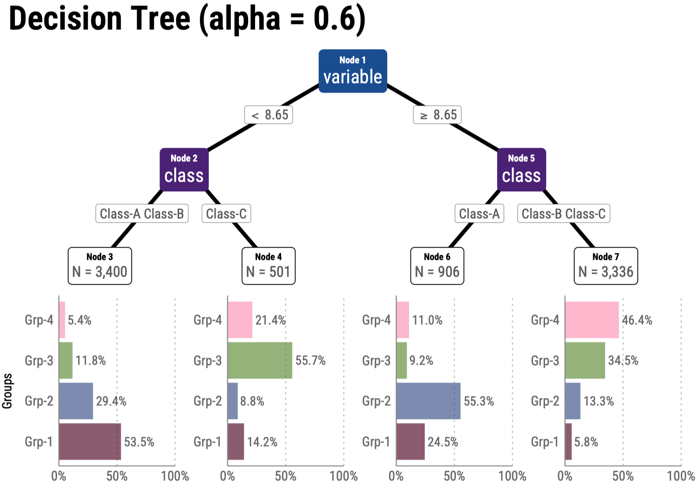

このブロックは summary です。  
<!\--more\--> までがリスト表示で出力されます.
summary: の設定より優先度が高いです. 

<!--more-->

---

{}

{}

## フォントファミリー (font-family)

179 g Q Ii Ll [R+SQL] データサイエンス100本ノック+α.

`179 g Q Ii Ll [R+SQL] データサイエンス100本ノック+α.`

**太字: 179 g Q Ii Ll [R+SQL] データサイエンス100本ノック+α.**

*斜体: 179 g Q Ii Ll [R+SQL] データサイエンス100本ノック+α.*

***太字+斜体: 179 g Q Ii Ll [R+SQL] データサイエンス100本ノック+α.***

## 絵文字

🧑‍💻 👨‍💻 👤 👾 🤖  
📈 📊 🔍 ⌨️ 🖥️ 💻 ⚙️ 🧠 🌐 🚀 🪐  
📁 📂 - フォルダ、リポジトリ  
📝 ✍️ - メモ  
📖 📒 🗒️ - ノート  
📘 📙 📕 📚 - 本  
⚠️ - 警告サイン, 最も一般的な注意や警告を示す絵文字  
❗ - 強い注意や緊急性を示す  
🔑 - 鍵、重要なポイントや核心を象徴します  
✔️ ☑️ ✅ - チェックマーク  
ℹ️ - 情報  
➡️ ⬅️ ⬆️ ⬇️ 👉  
:see_no_evil: :hear_no_evil: :speak_no_evil:

## Font Awesome

サイズなどのスタイル設定 → 


Alerts スタイルの参考サイト → 


<i class="fa-solid fa-circle-info"></i> 
<i class="fa-solid fa-lightbulb"></i>

<div style="text-align: center;">
  <i class="fa-solid fa-circle-info fa-3x" style="color: #0000FF;"></i>
  <h4 style="margin-top: 0.25em;">infomation</h4>
  <p>スタイル設定</p>
</div>

## shortcodes {#shortcodes}

###  と {} の違い


<br></br>
PAGE.RenderShortcodes は、コンテンツファイル内のショートコードをレンダリングするが、
Markdown は保持されることに注意。

### .Page を使用

```go-html-template {linenos=false,anchorLineNos=false}

```
» 

### .Site.Params. を使用

```go-html-template {linenos=false,anchorLineNos=false}

```
➡️ 

```go-html-template {linenos=false,anchorLineNos=false}

```
→ 

```go-html-template {linenos=false,anchorLineNos=false}

```
→ 

```go-html-template {linenos=false,anchorLineNos=false}

```
→ 

### 部分テンプレートを使用 (partial)

1. text を渡さない場合はデフォルトが適用される
   ```go-html-template {linenos=false,anchorLineNos=false}
   
   ```
   → 

2. text を渡す場合
   ```go-html-template {linenos=false,anchorLineNos=false}
   
   ```
   → 

### param {#param}

1. huto.yaml -> param.k100site.title

   ```go-html-template {linenos=false,anchorLineNos=false}
     
   ```
   →   

2. content内のparams

   ```go-html-template {linenos=false,anchorLineNos=false}
   
   ```
   →   

   ```go-html-template {linenos=false,anchorLineNos=false}
   
   ```
   → 

### href-target-blank

```go-html-template {linenos=false,anchorLineNos=false}

```
→  


```go-html-template {linenos=false,anchorLineNos=false}

```
→  


### product\-link

```go-html-template {linenos=false,anchorLineNos=false}

```
→  


```go-html-template {linenos=false,anchorLineNos=false}

```
→  


### ref {#ref}

```go-html-template
    → 絶対URL
 → 相対URL
```
→  
  


- overview#bbb へのリンク

  ```md {linenos=false,anchorLineNos=false}
  [overview-BBB はこちら]( "overview-BBB")
  ```
  → [overview-BBB はこちら]( "overview-BBB")

- overview.md#d2 へのリンク

  ```md {linenos=false,anchorLineNos=false}
   [overview-d2 はこちら]( "About us")
  ```
  → [overview-d2 はこちら]( "About us")

  Rendered:
  ```html {lineNos=false}
  <a href="http://example.org/overview/#bbb" title="About us">こちら</a>
  ```

### relref

- overview#d2 へのリンク

  ```md {linenos=false,anchorLineNos=false}
  [overview-d2 はこちら]( "About us")
  ```
  → [overview-d2 はこちら]( "About us")  
  Rendered:
  ``` html {lineNos=false}
  <a href="overview/#bbb" title="About us">こちら</a>
  ```

- lang="ja"

  ```md {linenos=false,anchorLineNos=false}
  [lang="ja" はこちら]()
  ```

  → [lang="ja" はこちら]()  

### comment {#comment}

```go-html-template {linenos=false,anchorLineNos=false}
{} 
TODO: rewrite the paragraph below. 
{}
```

{} 
TODO: rewrite the paragraph below. 
{}

### details

```html {linenos=false,anchorLineNos=false}
 
This is a **bold** word. 

```
⬇️
 
This is a **bold** word. 


### figure {#figure}

```html {linenos=false,anchorLineNos=false}

```
👉  


### レーティング　(星で示す難易度)

```html {linenos=false,anchorLineNos=false}
  
```

0〜5段階 : 

  
  
  
  
  
  

### Data sources

read: assets/test/pets.csv

```html {linenos=false,anchorLineNos=false}

```
⬇️  


## Code block (chroma) {#code-block}

### Code block with ```

#### Rコード {#r}

Rのコードは以下のようになります。

```r {linenos=true,lineNoStart=1,hl_lines=[2,"7-8"]}
receipt %>% 
  summarise(amount = sum(amount), .by = "sales_ymd") %>% 
  mutate(
    pre_sales_ymd = lag(sales_ymd, n = 1L, order_by = sales_ymd), 
    pre_amount = lag(amount, n = 1L, default = NA, order_by = sales_ymd)
  ) %>% 
  mutate(diff_amount = amount - pre_amount) %>% 
  arrange(sales_ymd) # コメント
```

Rのコードは以下のようになります。

```r {linenos=inline,lineNoStart=14,hl_lines=[2,"6-8"],anchorLineNos=true}
receipt %>% 
  summarise(amount = sum(amount), .by = "sales_ymd") %>% 
  mutate(
    pre_sales_ymd = lag(sales_ymd, n = 1L, order_by = sales_ymd), 
    pre_amount = lag(amount, n = 1L, default = NA, order_by = sales_ymd)
  ) %>% 
  mutate(diff_amount = amount - pre_amount) %>% 
  arrange(sales_ymd) # コメント
```

Rのコードは上記のようになります。

次はSQLです。

#### SQL

SQLのコードは以下のようになります。

```sql {linenos=false}
with customer_amount as (
  select
    customer_id, 
    SUM(amount) as total_amount
  from receipt
  where customer_id NOT LIKE 'Z%'
  group by customer_id
)
select 
  *
from
  customer_amount
where 
  total_amount >= (select AVG(total_amount) from customer_amount)
order by
  total_amount DESC
```

次は go-html-template コードです。

#### go-html-template コード

go-html-template のコードは以下のようになります。

```go-html-template {linenos=false,anchorLineNos=false}
<div><p>xxxxxxxxxxxxxxxxxxxxxx</p></div>
{{ if eq .Type "alert" }}
  <blockquote class="alert alert-{{ .AlertType }}">
    <p class="alert-heading">
      {{ transform.Emojify (index $emojis .AlertType) }}
      {{ with .AlertTitle }}
        {{ . }}
      {{ else }}
        {{ or (i18n .AlertType) (title .AlertType) }}
      {{ end }}
    </p>
    {{ .Text }}
  </blockquote>
{{ else }}
  <blockquote>
    {{ .Text }}
  </blockquote>
{{ end }}
```

次は go-text-template コードです。

#### go-text-template コード

go-text-template のコードは以下のようになります。

```go-text-template {linenos=false,anchorLineNos=false}
<div><p>xxxxxxxxxxxxxxxxxxxxxx</p></div>
{{ if eq .Type "alert" }}
  <blockquote class="alert alert-{{ .AlertType }}">
    <p class="alert-heading">
      {{ transform.Emojify (index $emojis .AlertType) }}
      {{ with .AlertTitle }}
        {{ . }}
      {{ else }}
        {{ or (i18n .AlertType) (title .AlertType) }}
      {{ end }}
    </p>
    {{ .Text }}
  </blockquote>
{{ else }}
  <blockquote>
    {{ .Text }}
  </blockquote>
{{ end }}
```

次は yaml です。

#### yaml

```yml {linenos=false}
params:
  assets:
    disableFingerprinting: true
```

次は text です。

#### textコード

```text {linenos=true,lineNoStart=1,hl_lines=["3-4",23], anchorLineNos=true}
100k
├── matome
│   ├── _index.md
│   └── tree.png
├── _index.md
├── advanced
│   ├── _index.md
│   └── ...
├── overview
│   └── index.md
├── setup
│   ├── index.md
│   └── line.png
├── standard
│   ├── _index.md
│   ├── r-003.md
│   └── r-028.md
└── tips
    └── index.md
```

Hugo's internal highlight. ⬇️

### Code block with Hugo's internal highlight shortcode {#code}

Rのコードは以下のようになります。


receipt %>% 
  summarise(amount = sum(amount), .by = "sales_ymd") %>% 
  mutate(
    pre_sales_ymd = lag(sales_ymd, n = 1L, order_by = sales_ymd), 
    pre_amount = lag(amount, n = 1L, default = NA, order_by = sales_ymd)
  ) %>% 
  mutate(diff_amount = amount - pre_amount) %>% 
  arrange(sales_ymd) # コメント


htmlのコードは以下のようになります。


{{ range .Pages }}
  <h2><a href="{{ .RelPermalink }}">{{ .LinkTitle }}</a></h2>
{{ end }}


go-html-template のコードは以下のようになります。


{{ range .Pages }}
  <h2><a href="{{ .RelPermalink }}">{{ .LinkTitle }}</a></h2>
{{ end }}


go-html-template のコードは上記のようになります。

## Markdown

### Markdown attributes

#### paragraph (段落)

```md {lineNos=false}
This is a paragraph.
{class="foo bar" id="baz"}
```
→  
This is a paragraph.
{class="foo bar" id="baz"}

``` {lineNos=false}
This is a paragraph.
{.foo .bar #baz}
```
→  
This is a paragraph.
{.foo .bar #baz}

Rendered: 
```html {lineNos=false}
<p class="foo bar" id="baz">This is a paragraph.</p>
```

#### blockquote {#blockquote}

``` {lineNos=false}
> This is a blockquote.
{class="foo bar"}
```
→ 

> This is a blockquote.
{class="foo bar"}
<!-- {class="foo bar" hidden=hidden} -->

Rendered: 
```html {lineNos=false}
<blockquote class="foo bar">
  <p>This is a blockquote.</p>
</blockquote>
```

### 引用 (\>, \>>)

#### 出典を明記しない引用

> *ブロック引用符内*でマークダウン構文を使用できることに**注意してください**。

``` {lineNos=false}
> - aaaaaaaaaaaaaaaaaaaaa
> - bbbbbbbbbbbbbbbbbbbbb
>> xxxxxxxxxxxxxxxxxxxxxxxxxxxx
```
→ 
> - aaaaaaaaaaaaaaaaaaaaa
> - bbbbbbbbbbbbbbbbbbbbb
>> xxxxxxxxxxxxxxxxxxxxxxxxxxxx

#### 出典を明記した引用

```htm {lineNos=false}
> Don't communicate by sharing memory, share memory by communicating.
>
> — <cite>Rob Pike[^3]</cite>
```
→ 
> Don't communicate by sharing memory, share memory by communicating.
> 
> — <cite>Rob Pike[^3]</cite>

[^3]: The above quote is excerpted from Rob Pike's [talk](https://www.youtube.com/watch?v=PAAkCSZUG1c) during Gopherfest, November 18, 2015.

#### footerを明記した引用

```html {lineNos=false}
> Don't communicate by sharing memory, share memory by communicating.
> <footer>Rob Pike</footer>
```
→ 
> Don't communicate by sharing memory, share memory by communicating.
> <footer>Rob Pike</footer>

### アラート (Alerts) {#alerts}

定義ファイル:
- layouts/_default/_markup/render-blockquote.html
- i18n/ja.yaml
- レイアウトの参考:  
  
  

```text {lineNos=false}
> [!TIP]
> Helpful advice for doing things better or more easily.
```

この blockquote レンダリング フックは、アラート指定子が存在する場合は多言語アラートをレンダリングする。

> [!NOTE]
> この blockquote レンダリング フックは、アラート指定子が存在する場合は多言語アラートをレンダリングし、
> それ以外の場合は CommonMarkdown の仕様に従って blockquote をレンダリングします。

この blockquote レンダリング フックは、アラート指定子が存在する場合は多言語アラートをレンダリングする。

> [!TIP]
> Helpful advice for doing things better or more easily.

この blockquote レンダリング フックは、アラート指定子が存在する場合は多言語アラートをレンダリングする。

> [!IMPORTANT]
> Key information users need to know to achieve their goal.

この blockquote レンダリング フックは、アラート指定子が存在する場合は多言語アラートをレンダリングする。

> [!WARNING]
> Urgent info that needs immediate user attention to avoid problems.

CAUTION は無し

### 注釈

テキスト[^1]  
テキスト[^2]

[^1]: 注釈1の内容

[^2]: 注釈2の内容

### Inline Code

これは `This is Inline Code` です。

### convert CSV to Markdown table

| aaaaaa   | bbbbbb   | cccccc   |
| ---: | :---: | :--- |
| 1   | 2   | 3   |

### convert Markdown table to CSV

aaaaaa,bbbbbb,cccccc  
1,2,3

### エスケープ (\\)

例2： \### aaa  
例1： \`インライン表示されなくなる`  

### 段落

テキストの行間に空白行を残すことで、新しい段落を作成できる.

### 改行

末尾にバックスラッシュ(\\)かスペース2つを含める: \
aaaaaaaaaaaaaaaaaa\
bbbbbbbbbbbbbbbbbbbbbb

### フォント

<pre>これはPlainテキスト。</pre>

```html {linenos=false,anchorLineNos=false}
<font color="Red">カラーテキスト</font>
```
→ <font color="Red">カラーテキスト</font>

\~ or ~~: \
~~打ち消し線~~  
ABC ~打ち消し線~ XYZ  

\*, **, ***: \
*斜体*  
**太字 Igl**  
***太字と斜体 Igl***

<i>このテキストは斜体です</i>
<em>このテキストは強調（斜体）されています</em>

\<ins>: \
これは<ins>下線付きの文章</ins>です。

\<sub> :\
これは下付き<sub>テキスト</sub>です。

\<sup>: \
これは上付き<sup>テキスト</sup>です。

\<mark>: \
Most <mark>salamanders</mark> are nocturnal, and hunt for insects, worms, and other small creatures.

\<kbd>: \
Press <kbd><kbd>CTRL</kbd>+<kbd>ALT</kbd>+<kbd>Delete</kbd></kbd> to end the session.


### タスクリスト

- [x] aaaaaaaaaaaaaaaaa
- [ ] bbbbbbbbbbbbbbbbbb
- [x] cccccccccccccccccccc 


### 記号

...  
<< >>  
'  ‘  ’  "  ”  

--  

### 画像

shortcodes: figure を使う！

``` md

```


---

### リスト

リストの前にギャップがある.
1. [SITE.全ページ](https://gohugo.io/methods/site/allpages/) すべての言語のすべてのページのコレクションを返します。
   - [サイト.ページ](https://gohugo.io/methods/site/pages/)すべてのページのコレクションを返します。
   - [SITE.通常ページ](https://gohugo.io/methods/site/regularpages/)すべての通常ページのコレクションを返します。  
     ノート
     - 最初のレベルのセクションページのコレクションを返します。
     - [サイトセクション](https://gohugo.io/methods/site/sections/)最初のレベルのセクションページのコレクションを返します。

2. デフォルトでは、Hugo はページ コレクションを次のように並べ替えます。

   1.  [重さ](https://gohugo.io/methods/page/weight/)、[日付](https://gohugo.io/methods/page/date/)の降順
   2.  [LinkTitle が](https://gohugo.io/methods/page/linktitle/)[Title](https://gohugo.io/methods/page/title/)に戻る[](https://gohugo.io/methods/page/title/)
   3.  [](https://gohugo.io/methods/page/file/#filename)ページがファイルによってバックアップされている場合は[ファイル名](https://gohugo.io/methods/page/file/#filename)
       - これらのメソッドを使用してページ コレクションを並べ替えます。
       - これらのメソッドを使用してページ コレクションを並べ替えます。  
For example, the base template below calls the [partial](https://gohugo.io/functions/partials/include/) function to include partial templates for the `head`, `header`, and `footer` elements of each page, and it uses the [block](https://gohugo.io/functions/go-template/block/) function to include `home`, `single`, `section`, `taxonomy`, and `term` templates within the `main` element of each page.

A home template renders your site’s home page. For a single page site this is the only required template. For example, the home template below inherits the site’s shell from the base template, and renders the home page content with a list of pages.

ショートコードの定義方法に応じて、引数は名前付き、位置指定、またはその両方になりますが、1 回の呼び出しで引数タイプを混在させることはできません。

---

## H2 全角と半角のサイズ比較 (alphabet)

## h2 example

### H3 部分テンプレート

### h3 example

#### H4 部分テンプレート

#### h4 alphabet

ショートコードの定義方法に応じて、引数は名前付き、位置指定、またはその両方になりますが、1 回の呼び出しで引数タイプを混在させることはできません。

## H2 見出し2 ショートコード

Hugo は、特定のページのテンプレートを選択する際に、以下にリストされているパラメータを考慮します。テンプレートは、詳細度によって順序付けられています。

### H3 見出し3 埋め込みショートコード

Hugo は、特定のページのテンプレートを選択する際に、以下にリストされているパラメータを考慮します。テンプレートは、詳細度によって順序付けられています。

```go-html-template {linenos=false,anchorLineNos=false}
{} 
TODO: rewrite the paragraph below. 
{}
```

これは自然なことのはずですが、さまざまなパラメータのバリエーションの具体的な例については、以下の表をご覧ください。

ショートコードの定義方法に応じて、引数は名前付き、位置指定、またはその両方になりますが、1 回の呼び出しで引数タイプを混在させることはできません。

#### H4 見出し4 コンテンツファイル内のシンプルなスニペット

ショートコードの定義方法に応じて、引数は名前付き、位置指定、またはその両方になりますが、1 回の呼び出しで引数タイプを混在させることはできません。名前付き引数の形式は、`name="value"`という形式の HTML の形式をモデルにしています。

#### H4 見出し4 ショートコード

Hugo は、特定のページのテンプレートを選択する際に、以下にリストされている**パラメータ**を考慮します。**テンプレート**は、詳細度によって順序付けられています。

```r {linenos=true,lineNoStart=1,hl_lines=[2,"7-8"]}
receipt %>% 
  summarise(amount = sum(amount), .by = "sales_ymd") %>% 
  mutate(
    pre_sales_ymd = lag(sales_ymd, n = 1L, order_by = sales_ymd), 
    pre_amount = lag(amount, n = 1L, default = NA, order_by = sales_ymd)
  ) %>% 
  mutate(diff_amount = amount - pre_amount) %>% 
  arrange(sales_ymd) # コメント
```

これは自然なことのはずですが、さまざまなパラメータのバリエーションの具体的な例については、以下の表をご覧ください。

##### H5 見出し5

Hugo は、特定のページのテンプレートを選択する際に、以下にリストされているパラメータを考慮します。テンプレートは、詳細度によって順序付けられています。

これは自然なことのはずですが、さまざまなパラメータのバリエーションの具体的な例については、以下の表をご覧ください。

###### H6 見出し6

Hugo は、特定のページのテンプレートを選択する際に、以下にリストされているパラメータを考慮します。

テンプレートは、詳細度によって順序付けられています。これは自然なことのはずですが、さまざまなパラメータのバリエーションの具体的な例については、以下の表をご覧ください。

#### H4 ページセクション

現在のセクション内の通常のページと、直下の子孫セクションのセクション ページのコレクションを返します。

#### H4 PAGE.通常ページ

現在のセクション内の通常のページのコレクションを返します。

#### H4 PAGE.RegularPagesRecursive

現在のセクション内の通常のページと、すべての子孫セクション内の通常のページのコレクションを返します。

## H2 見出し2 セクションには、1つ以上の祖先 (ホームページを含む) と、0個以上の子孫があります

### H3 見出し3 ショートコードは、組み込みテンプレートまたはカスタムテンプレートを呼び出すコンテンツファイル内のシンプルなスニペット

#### H4 見出し4 ショートコードは、組み込みテンプレートまたはカスタムテンプレートを呼び出すコンテンツファイル内のシンプルなスニペット

Hugo は、特定のページのテンプレートを選択する際に、以下にリストされているパラメータを考慮します。テンプレートは、詳細度によって順序付けられています。これは自然なことのはずですが、さまざまなパラメータのバリエーションの具体的な例については、以下の表をご覧ください。

#### alphabet

指定されたページの直下のセクションごとに 1 つずつ、セクション ページのコレクションを返します。

### Mathematics in Markdown

- This is an inline \(a^*=x-b^*\) equation.

- These are block equations:

\[a^*=x-b^*\]

\[ a^*=x-b^* \]

\[
a^*=x-b^*
\]

- These are also block equations:

$$a^*=x-b^*$$

$$ a^*=x-b^* $$

$$
a^*=x-b^*
$$

- aligned

\[
\begin{aligned}
KL(\hat{y} || y) &= \sum_{c=1}^{M}\hat{y}_c \log{\frac{\hat{y}_c}{y_c}} \\
JS(\hat{y} || y) &= \frac{1}{2}(KL(y||\frac{y+\hat{y}}{2}) + KL(\hat{y}||\frac{y+\hat{y}}{2}))
\end{aligned}
\]

-  math contexts の外では$をダブルエスケープする: 

```text {lineNos=false}
A \\$5 bill _saved_ is a \\$5 bill _earned_.
```

→  A \\$5 bill _saved_ is a \\$5 bill _earned_.

- Chemistry

$$C_p[\ce{H2O(l)}] = \pu{75.3 J // mol K}$$

## Diagrams

### GoAT diagrams (ASCII) 

```goat
      .               .                .               .--- 1          .-- 1     / 1
     / \              |                |           .---+            .-+         +
    /   \         .---+---.         .--+--.        |   '--- 2      |   '-- 2   / \ 2
   +     +        |       |        |       |    ---+            ---+          +
  / \   / \     .-+-.   .-+-.     .+.     .+.      |   .--- 3      |   .-- 3   \ / 3
 /   \ /   \    |   |   |   |    |   |   |   |     '---+            '-+         +
 1   2 3   4    1   2   3   4    1   2   3   4         '--- 4          '-- 4     \ 4

```

## shortcodes (SNS)

### twitter

```html {linenos=false,anchorLineNos=false}

```
→ 


---

### instagram

<!-- https://www.instagram.com/p/CxOWiQNP2MO/ -->
<!--  -->

<!-- https://www.instagram.com/p/C9Tq0qdPSTF -->

```html {linenos=false,anchorLineNos=false}

```
→ 


---

### youtube

```html {linenos=false,anchorLineNos=false}

```
→ 

<!-- https://www.youtube.com/watch?v=0RKpf3rK57I -->

---

### vimeo

```html {linenos=false,anchorLineNos=false}

```
→ 

<!-- https://vimeo.com/channels/staffpicks/55073825 -->

